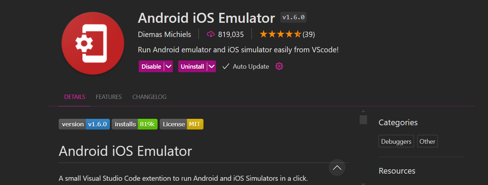

# GW Hatchet Mobile

## Patch Notes
- This has only been tested on Android devices. There should be support for iOS devices as well, but it has not been tested.
## How to Run Locally

1. Install the Latest Version of Node.js
```
node -v
```

2. Run npm install to install depenedecies
```
npm install
```
3. Install an Android emulator. You can use this extension on VScode or view it on Android Studio.


3. Run npm start
```
npm start
```

4. When prompted, press S to switch to Expo Go development build
```
Scan the QR code above to open the project in a development build. Learn more: https://expo.fyi/start

› Using development build
› Press s │ switch to Expo Go

› Press a │ open Android
› Press w │ open web

› Press j │ open debugger
```

5. Press a to open the application on Android
```
Using Expo Go
› Press s │ switch to development build

› Press a │ open Android
› Press w │ open web

› Press j │ open debugger
› Press r │ reload app
› Press m │ toggle menu
› Press o │ open project code in your editor
```
